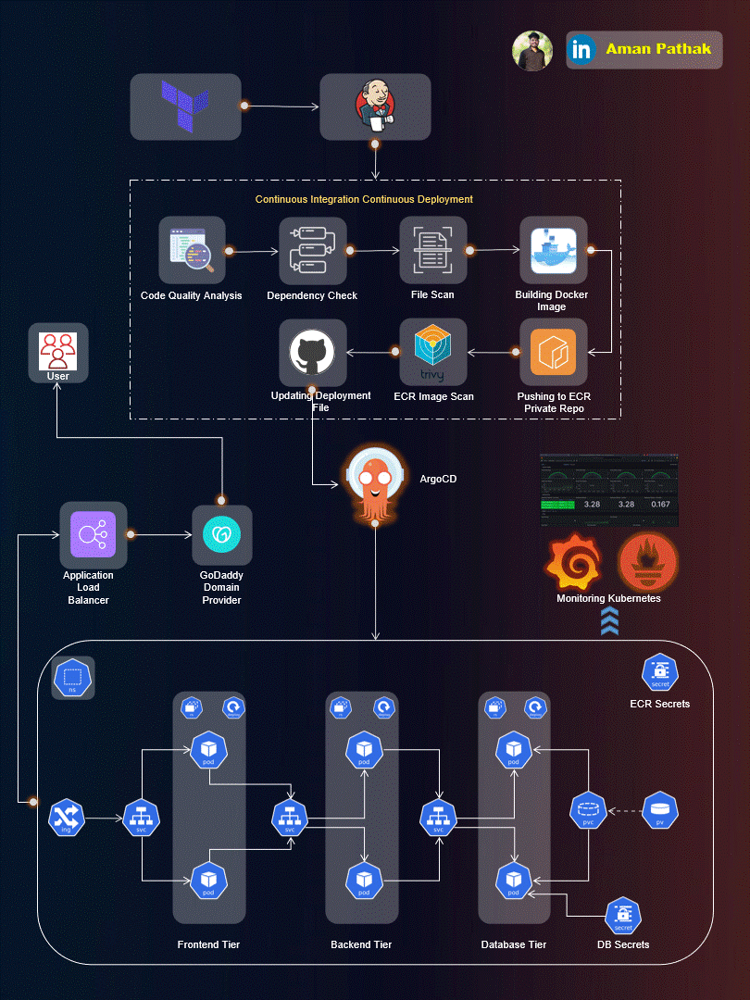

# Three-Tier Web Application Deployment on AWS EKS using AWS EKS, ArgoCD, Prometheus, Grafana, and Jenkins

Welcome to the Three-Tier Web Application Deployment project! 🚀

This repository hosts the implementation of a Three-Tier Web App using ReactJS, NodeJS, and MongoDB, deployed on AWS EKS. The project covers a wide range of tools and practices for a robust and scalable DevOps setup.

## Table of Contents
- [Application Code](#application-code)
- [Jenkins Pipeline Code](#jenkins-pipeline-code)
- [Jenkins Server Terraform](#jenkins-server-terraform)
- [Kubernetes Manifests Files](#kubernetes-manifests-files)
- [Project Details](#project-details)

## Application Code
The `Application-Code` directory contains the source code for the Three-Tier Web Application. Dive into this directory to explore the frontend and backend implementations.

## Jenkins Pipeline Code
In the `Jenkins-Pipeline-Code` directory, you'll find Jenkins pipeline scripts. These scripts automate the CI/CD process, ensuring smooth integration and deployment of your application.

## Jenkins Server Terraform
Explore the `Jenkins-Server-TF` directory to find Terraform scripts for setting up the Jenkins Server on AWS. These scripts simplify the infrastructure provisioning process.

## Kubernetes Manifests Files
The `Kubernetes-Manifests-Files` directory holds Kubernetes manifests for deploying your application on AWS EKS. Understand and customize these files to suit your project needs.

## Project Details
🛠️ **Tools Explored:**
- Terraform & AWS CLI for AWS infrastructure
- Jenkins, Sonarqube, Terraform, Kubectl, and more for CI/CD setup
- Helm, Prometheus, and Grafana for Monitoring
- ArgoCD for GitOps practices

🚢 **High-Level Overview:**
- IAM User setup & Terraform magic on AWS
- Jenkins deployment with AWS integration
- EKS Cluster creation & Load Balancer configuration
- Private ECR repositories for secure image management
- Helm charts for efficient monitoring setup
- GitOps with ArgoCD - the cherry on top!

📈 **The journey covered everything from setting up tools to deploying a Three-Tier app, ensuring data persistence, and implementing CI/CD pipelines.**

## Getting Started
To get started with this project, refer to our [comprehensive guide](https://amanpathakdevops.medium.com/advanced-end-to-end-devsecops-kubernetes-three-tier-project-using-aws-eks-argocd-prometheus-fbbfdb956d1a) that walks you through IAM user setup, infrastructure provisioning, CI/CD pipeline configuration, EKS cluster creation, and more.

## Contributing
We welcome contributions! If you have ideas for enhancements or find any issues, please open a pull request or file an issue.

## License
This project is licensed under the [MIT License](LICENSE).

Happy Coding! 🚀

eksctl create cluster --name i2-group-eks-cluster --region us-east-1 --node-type t2.medium --nodes-min 2 --nodes-max 2
aws eks update-kubeconfig --region us-east-1 --name i2-group-eks-cluster
eksctl utils associate-iam-oidc-provider --region=us-east-1 --cluster=i2-group-eks-cluster --approve

eksctl create iamserviceaccount --cluster=i2-group-eks-cluster --namespace=kube-system --name=aws-load-balancer-controller --role-name AmazonEKSLoadBalancerControllerRole --attach-policy-arn=arn:aws:iam::211125430491:policy/AWSLoadBalancerControllerIAMPolicy --approve --region=us-east-1

eksctl create iamserviceaccount --cluster=Three-Tier-K8s-EKS-Cluster --namespace=kube-system --name=aws-load-balancer-controller --role-name AmazonEKSLoadBalancerControllerRole --attach-policy-arn=arn:aws:iam::<your_account_id>:policy/AWSLoadBalancerControllerIAMPolicy --approve --region=us-east-1

eksctl create iamserviceaccount \
    --cluster=i2-group-eks-cluster \
    --namespace=kube-system \
    --name=aws-load-balancer-controller \
    --attach-policy-arn=arn:aws:iam::211125430491:policy/AWSLoadBalancerControllerIAMPolicy \
    --override-existing-serviceaccounts \
    --region us-east-1 \
    --approve

helm install aws-load-balancer-controller eks/aws-load-balancer-controller \
  -n kube-system \
  --set clusterName=i2-group-eks-cluster \
  --set serviceAccount.create=false \
  --set region=us-east-1 \
  --set vpcId=vpc-03e473ea842dd6266 \
  --set serviceAccount.name=aws-load-balancer-controller

  eksctl create nodegroup \
  --cluster i2-group-eks-cluster \
  --region us-east-1 \
  --name i2-group-node-group \
  --node-type t2.medium \
  --nodes 2 \
  --nodes-min 1 \
  --nodes-max 3 \
  --managed

  kubectl create secret generic ecr-registry-secret \
  --from-file=.dockerconfigjson=${HOME}/.docker/config.json \
  --type=kubernetes.io/dockerconfigjson --namespace i2-group

kubectl get secrets -n i2-group

sonar-token: squ_10ddfa7a74aa8270f704e5791f951a2255044279

Frontend
sonar-scanner \
  -Dsonar.projectKey=i2-frontend \
  -Dsonar.sources=. \
  -Dsonar.host.url=http://44.203.63.218:9000 \
  -Dsonar.login=squ_10ddfa7a74aa8270f704e5791f951a2255044279

  Backend
  sonar-scanner \
  -Dsonar.projectKey=i2-group-backend \
  -Dsonar.sources=. \
  -Dsonar.host.url=http://44.203.63.218:9000 \
  -Dsonar.login=squ_10ddfa7a74aa8270f704e5791f951a2255044279

  stage("Docker Image Build & Push") {
    steps {
        script {
            dir('Application-Code/backend') {
                sh '''
                    docker build -t ${AWS_ECR_REPO_NAME}:${BUILD_NUMBER} .
                    docker tag ${AWS_ECR_REPO_NAME}:${BUILD_NUMBER} ${REPOSITORY_URI}${AWS_ECR_REPO_NAME}:${BUILD_NUMBER}
                    docker push ${REPOSITORY_URI}${AWS_ECR_REPO_NAME}:${BUILD_NUMBER}
                '''
            }
        }
    }
}
